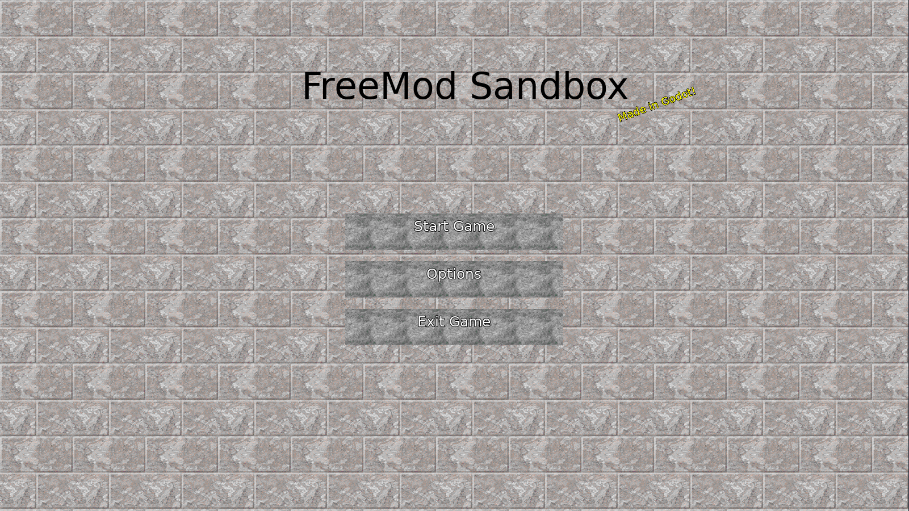

# FreeMod Sandbox

This is an experimental FPS sandbox game inspired by Gmod. The basic idea is "Gmod, but with Quake 1 mods instead of Half Life 2."

Current features, with varying levels of completeness: 
   - Supports Quake .map files (Using the add-on Qodot)
   - A modular scripted weapon ("Swep") system
   - A modular tool system
   - A modular NPCS system
   - A library of default assets:
     - Weapons/enemies from the Quake 1 mod "Navy Seals"
     - Small collection of default props
   - High quality Quake-style movement code
   - The ability to define different gamemodes

Planned features:
   - Multiplayer
   - Default game modes

Language: GDScript

## Screenshots

## Licenses

See the directory ./attribute
